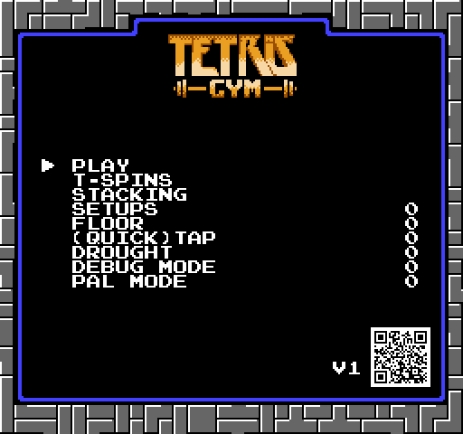

# TetrisGYM

    
     

 

* [Getting Started](#guide)
* [Trainers](#modes)
    * [Tetris](#tetris)
    * [T-Spins](#t-spins)
    * [Stacking](#stacking)
    * [Setups](#setups)
    * [Floor](#floor)
    * [(Quick)Tap](#%28quick%29-tap)
    * [Garbage](#garbage)
    * [Drought](#drought)
* [Debug Mode](#debug-mode)
    * [Level Editor](#level-editor)
    * [Savestates](#savestates)
    * [Controller Input Display](#controller-input-display)
* [PAL Mode](#pal-mode)
* [Resources](#resources)

## Getting Started

TetrisGYM is a modification of NES Tetris.

While originally based on the NTSC version of the game, the patched ROM supports PAL and NTSC gameplay types.

TetrisGYM is distributed in the form of a BPS patch and can be applied to the USA version of the game with [Rom PatcherJS](https://www.romhacking.net/patch/) or similar.

A link to the BPS can be found on the [releases page](https://github.com/kirjavascript/TetrisGYM/releases).

## Trainers

Some trainers have additional configuration values; use left and right to change them.

### Tetris

Same gameplay as Type-A, with some improvements: no score cap, no rocket, no curtain, always next box, better pause, extended level select.

### T-Spins

Spawn T-Spins in random positions. Additional entry delay on successful T-Spin to prepare for the next state.

### Stacking

An experiment in highlighting areas of the playfield.

### Setups

Several preset playfields for practising different types of tucks and spins.

0. Z
1. T / S
2. T
3. I
4. Buco
5. Various
6. L / J Double

### Floor

Fill in the floor to a certain height to force higher stacking. This mode is often referred to as 'handicap'.

Setting the height to zero will result in a game mode with burns disabled.

### (Quick)Tap

For practising tapping and quicktapping pieces over towers. 0-G will have a tower on the left of the screen and H-W will have a tower to the right.

### Garbage

Different styles of garbage to dig through.

0. Always Tetris Ready - Pushes blocks to force tetris readiness
1. Normal Garbage - Random amounts of garbage
2. Smart Garbage - Follows your well
3. Hard Garbage - Brutal random garbage
4. Infinite Dig Generator - Scrambles the bottom of your stack

### Drought

Create artificially inflated droughts. Increasing the value causes less I pieces.

0 = normal gameplay I = no line pieces

## Debug Mode

Allow more fine control over aspects of gameplay.

This is a config option only, and will enable debug mode globally. 

When enabled, press start to go into debug mode.

### Level Editor

* DPad
        Move around  
* Select + Left  
        Switch between piece and playfield editors

In piece mode

* A / B  
    Change the current piece
* A + B  
    Change the next piece

In playfield mode

* A  
    Draw block at cursor
* B  
*   Delete block at cursor

### Savestates

When paused

* Select + Up  
        Increment save slot
* Select + Up  
        Decrement save slot
* Select + A  
        Save state
* Select + B  
        Load state

During gameplay

* Select + B  
        Load state

Savestates require SRAM to work, but are tested and working on Everdrive / Emulator / MiSTerFPGA.

Combined with the level editor, savestates are effective for practising specific scenarios.

### Controller input display

* Select + Right  
        Toggle controller input display

## PAL Mode

Dictate if the NTSC or PAL gameplay mechanics should be used. Should automatically detect region, but can be manually overwritten otherwise.

## Resources

base disassembly: [https://github.com/CelestialAmber/TetrisNESDisasm](https://github.com/CelestialAmber/TetrisNESDisasm)  
disassembly information: [https://github.com/ejona86/taus](https://github.com/ejona86/taus)

